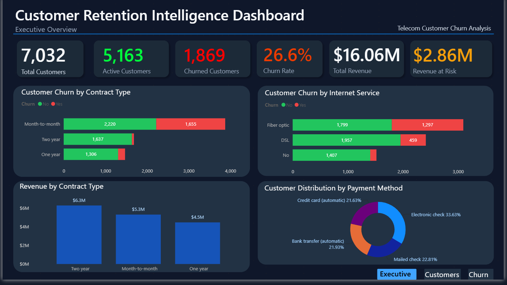
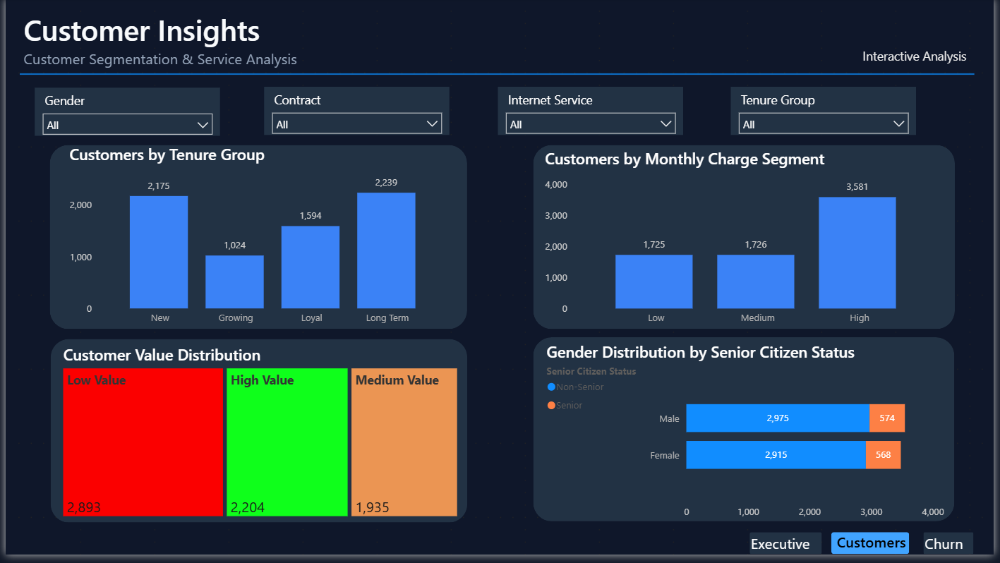
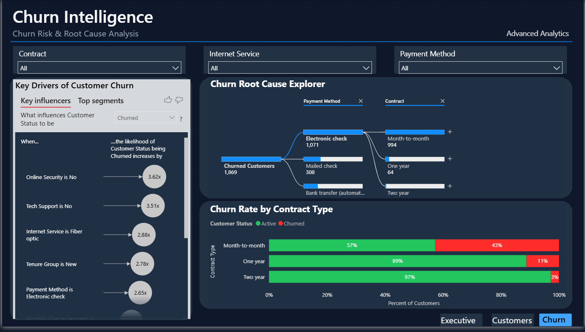

# 📉 Customer Retention Intelligence Dashboard (Power BI)

An interactive Power BI dashboard built to analyze telecom customer churn, explore customer behavior, and uncover actionable business insights through data visualization and analytics.

---

## 📌 Project Overview

Customer retention is a critical challenge for telecom companies, where understanding why customers leave can help reduce revenue loss and improve long-term growth.

This project analyzes customer churn using Power BI by transforming raw customer data into an interactive dashboard that highlights customer behavior, churn trends, revenue impact, and the key factors influencing customer retention.

---

## Objectives

- Analyze overall customer churn and retention performance.
- Identify high-risk customer segments.
- Explore the relationship between contract type, internet service, payment method, and churn.
- Measure the financial impact of customer churn.
- Present insights through an interactive business intelligence dashboard.

---

## Dashboard Pages

### Executive Overview

Provides a high-level summary of business performance, including:

- Total Customers
- Active Customers
- Churned Customers
- Churn Rate
- Total Revenue
- Revenue at Risk
- Customer Churn by Contract Type
- Customer Churn by Internet Service
- Revenue by Contract Type
- Customer Distribution by Payment Method



---

### Customer Insights

Focuses on customer segmentation and behavior using interactive filters.

Highlights include:

- Customer Segmentation
- Tenure Analysis
- Monthly Charge Segments
- Customer Value Distribution
- Gender Distribution
- Senior Citizen Analysis

Interactive slicers allow users to filter insights by:

- Gender
- Contract
- Internet Service
- Tenure Group



---

### Churn Intelligence

Provides advanced analytics to understand the root causes of customer churn.

Features include:

- AI Key Influencers
- Churn Root Cause Explorer (Decomposition Tree)
- Contract-wise Churn Comparison
- Interactive Filtering

This page helps identify the factors contributing most to customer churn and supports data-driven decision making.



---

## 🛠️ Tools & Technologies

- Power BI Desktop
- Power Query
- DAX
- Data Modeling
- Microsoft Excel

---

## 📂 Repository Structure

```
Customer-Retention-Intelligence-Dashboard-PowerBI
│
├── Dashboard
│   └── Customer_Retention_Intelligence_Dashboard.pbix
│
├── Data
│   ├── Telecom_Customer_Churn_Raw.csv
│   └── Telecom_Customer_Churn_Cleaned.csv
│
├── Images
│   ├── Executive_Overview.png
│   ├── Customer_Insights.png
│   └── Churn_Intelligence.png
│
└── README.md
```

---

## 📈 Key Insights

- Approximately **26.6%** of customers have churned.
- **Month-to-month contracts** experience significantly higher churn than long-term contracts.
- Customers using **Fiber Optic** internet services show a higher likelihood of churning.
- **Electronic Check** is the most common payment method among churned customers.
- Nearly **$2.86M** in revenue is at risk due to customer churn.
- Customers with longer tenure generally demonstrate better retention.

---

## 💡 Skills Demonstrated

- Data Cleaning
- Data Modeling
- DAX Measures
- Power Query
- KPI Development
- Dashboard Design
- Customer Segmentation
- Churn Analysis
- Business Intelligence
- Data Storytelling

---

## 📁 Dataset

The dashboard uses a telecom customer churn dataset containing customer demographics, account information, subscribed services, billing details, and churn status.

The dataset was cleaned and transformed using Power Query before being modeled in Power BI.

---

## How to Use

1. Clone this repository.
2. Open the `.pbix` file using **Power BI Desktop**.
3. Explore each dashboard page using the interactive filters.
4. Analyze customer behavior, churn patterns, and business performance.

---

## 👨‍💻 Author

**Ronak Agarwall**

Aspiring Data Analyst passionate about building interactive dashboards and transforming raw data into meaningful business insights.

---

⭐ If you found this project interesting, feel free to star the repository!
